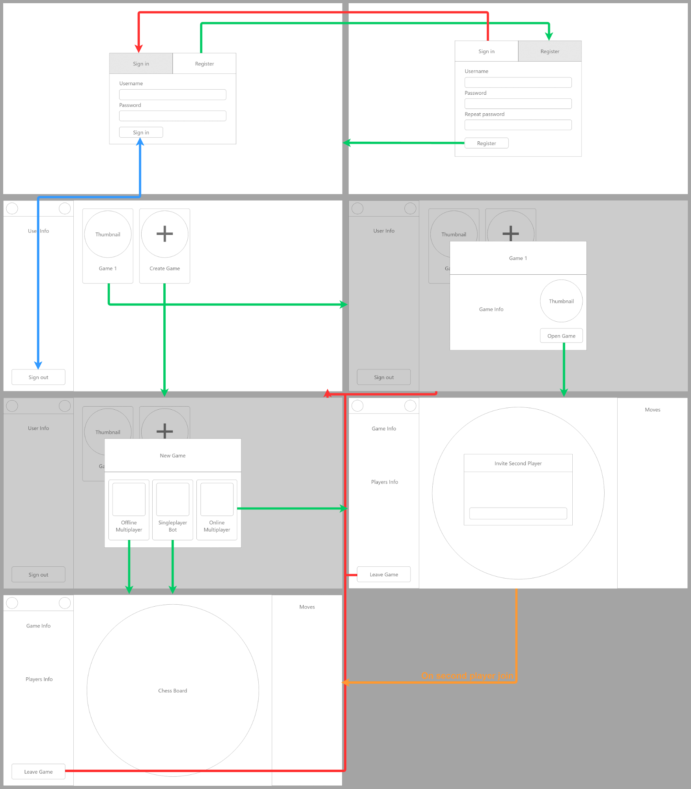
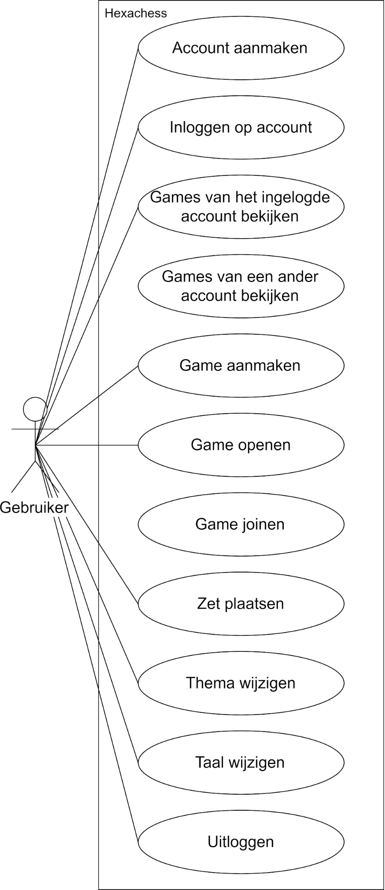
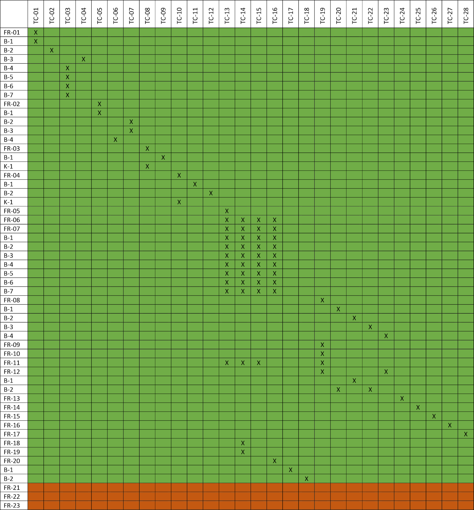

# Hexachess Analysedocument 

| Klas  | Semester 2 |
| :---- | ---------: |
| Datum | 14-06-2019 |

## Inhoud

[Inleiding](#inleiding)  
[Functionele requirements](#functionele-requirements)  
[User Interface](#user-interface)  
[Use Cases](#use-cases)  
[Test Cases](#test-cases)  
[Test Matrix](#test-matrix)  

## Inleiding

Dit is het analysedocument van Hexachess. Hierin zijn de functionele requirements, user interface schetsen, use cases, test cases en test matrix gedocumenteerd.

De killer app die ik dit semester ga maken heet Hexachess. In hexachess kan een account worden aangemaakt op de website waar alle games aan gekoppeld zullen worden. Alle games die gekoppeld zijn aan de gebruiker worden weergegeven op de overzichtspagina. Daar kan de gebruiker een nieuw spel aanmaken of een game selecteren om spellen terug te kijken.

## Functionele requirements 

De functionele eisen van de applicatie zijn hieronder beschreven met behulp van de MoSCow-methode. Deze eisen worden onderverdeeld in vier categorieën:

- Must-haves voor de essentiële eisen, deze hebben de hoogste prioriteit.  
- Should-haves voor belangrijke eisen die iets minder tijd gevoelig zijn.  
- Could-haves voor mogelijke uitbreidingen in de applicatie.  
- Would-haves voor mogelijke uitbreidingen die waarschijnlijk niet terug zullen komen in dit eindproduct.

### Must-have

1. De gebruiker kan een account aanmaken.  
   1. Voor het aanmaken van accounts wordt een gebruikersnaam, wachtwoord en verificatie wachtwoord vastgelegd.  
   2. De gebruikersnaam mag niet in reeds in gebruik zijn.  
   3. Het het wachtwoord moet overeenkomen het verificatie wachtwoord.  
   4. Het wachtwoord bestaat uit 8 of meer karakters.  
   5. Het wachtwoord bestaat uit minder dan 256 karakters.  
   6. De gebruikersnaam bestaat uit meer dan 3 karakters.  
   7. De gebruikersnaam bestaat uit minder dan 25 karakters.  
2. De gebruiker kan inloggen zijn/haar account.  
   1. Voor het inloggen op accounts wordt een gebruikersnaam en wachtwoord vastgelegd.  
   2. De gebruikersnaam mag niet leeg zijn.  
   3. Het wachtwoord mag niet leeg zijn.  
   4. De gebruikersnaam en het wachtwoord komen overeen met aangemaakte account.  
3. De gebruiker kan een overzicht bekijken van de games die hij/zij heeft gespeeld.  
   1. Het account van de gebruiker is gekoppeld aan een of meerdere games.  
      1. De games worden aflopend gesorteerd op de datum waarop ze zijn toegevoegd.  
4. De gebruiker kan een overzicht bekijken van de games die door een ander account zijn gespeeld.  
   1. Het geselecteerde account bestaat.  
   2. Het geselecteerde account is gekoppeld aan een of meerdere games.  
      1. De games worden aflopend gesorteerd op de datum waarop ze zijn toegevoegd.  
5. De gebruiker kan een turn based offline multiplayer game aanmaken.  
6. De gebruiker kan een opgeslagen game openen.  
7. Er kan een bord gegenereerd worden op basis van een game door het systeem.  
   1. Het bord bestaat uit een grid.  
   2. De grid bevat 11 rijen en bevat in totaal 91 hexagonen.  
   3. De rijen zijn gevuld met de benodigde hoeveelheid hexagonen voor een zeshoekig bord.  
   4. De hexagonen krijgen de juiste kleur toegewezen om tot het schaakpatroon te komen.  
   5. De schaakstukken worden geplaatst op de standaard posities.  
   6. De zetten opgeslagen in het systeem worden toegepast op het bord.  
   7. De mogelijke posities worden berekend en opgeslagen in de schaakstukken.  
8. De gebruiker kan een zet doen.  
   1. De het account van de gebruiker is gekoppeld aan de game.  
   2. De gebruiker is aan de beurt.  
   3. Het schaakstuk is van de gebruiker.  
   4. Het schaakstuk wordt verplaatst naar een van de mogelijke posities.  
9. Het systeem geeft de beurt aan de volgende speler na een zet.  
10. De gebruiker krijgt de nieuwe versie van het bord te zien na het verplaatsen van een stuk.  
11. De gebruiker kan de zet-historie zien op de gamepagina.  
12. De gebruiker kan bij het optillen van een schaakstuk zien naar welke posities het schaakstuk verplaatst kan worden.  
    1. De gebruiker is aan de beurt.  
    2. Het schaakstuk is van de gebruiker.  
13. Als een koning van een speler schaakmat staat eindigt het spel en wint de andere speler.  
14. Als een speler pat staat eindigt het spel en zal de andere kleur winnen.  
15. Het thema kan gewijzigd worden.  
16. De taal kan gewijzigd worden.  
17. De gebruiker kan uitloggen op een account.

K-ALG1 Bij onjuiste invoer van een form wordt de bijbehorende foutmelding getoond.

### Should-have

18. De gebruiker kan een multiplayer game aanmaken.  
19. De gebruiker krijgt een uitnodigingslink die gekoppeld is aan de multiplayer game.  
20. De gebruiker kan een multiplayer game joinen door middel van het openen van een uitnodigings link.  
    1. Er is nog geen tweede speler gekoppeld aan de game.  
    2. De gebruiker is niet degene die het spel heeft aangemaakt.  
21. De gebruiker kan een bot game aanmaken en spelen tegen de computer.

### Could-have

22. De single player bot modus bevat 3 moeilijkheidsgraden; easy, normal en hard.  
23. De verschillende spelmodus kunnen gespeeld worden met een tijdklok van een bepaald aantal seconden waarbinnen een zet gespeeld moet worden.

### Would-have

\-

## User Interface

Wanneer er een menu verschijnt kan deze worden gesloten door op de grijze achtergrond te klikken.

Prototype: [https://xd.adobe.com/view/0ec5efc7-e3ee-4cdd-5859-6771a326d4d4-78f4/](https://xd.adobe.com/view/0ec5efc7-e3ee-4cdd-5859-6771a326d4d4-78f4/)

## Use Cases

De use cases van de applicatie zijn hieronder beschreven met behulp van tabellen. In deze tabellen worden de volgende vier aspecten van vier categorieën:

- Samenvatting voor een beschrijving van de eis(en) die de use case zal dekken  
- Actor voor de/dat-gene die/wat de eis zal uitvoeren  
- Aannamen voor de benodigde voorwaarden om de use case uit te voeren.  
- Beschrijving voor de stappen die benodigd zijn om de use case uit te voeren.  
- Resultaat voor de gewenste uitkomst.

### Use cases

| Use Case       | Account aanmaken                                                                                                                                                                                                                                                                  | UC01 |
| :------------- | :-------------------------------------------------------------------------------------------------------------------------------------------------------------------------------------------------------------------------------------------------------------------------------- | :--- |
| Samenvatting   | Na invoer van de vereiste gegevens wordt het account toegevoegd aan het systeem.                                                                                                                                                                                                  |      |
| Actor          | De gebruiker                                                                                                                                                                                                                                                                      |      |
| Aannamen       | De startpagina van de website is geladen door de actor en er is een actieve internetverbinding. De actor is uitgelogd.                                                                                                                                                            |      |
| Beschrijving   | De actor geeft aan een account aan te willen maken. Het systeem toont een pagina waarop de account gegevens ingevuld kunnen worden (zie FR-1.B-1). De actor voert de gevraagde gegevens in en bevestigt. Het systeem controleert de ingevoerde gegevens en voegt het account toe. |      |
| Uitzonderingen | Niet alle benodigde gegevens zijn correct ingevuld. Toon een melding (K-ALG1) en ga terug naar stap 3\. (FR-1.B-3 t/m FR-1.B-7) De gebruikersnaam is al in gebruik. Toon een melding en ga terug naar stap 3\. (FR-1.B-2)                                                         |      |
| Resultaat      | Er is een nieuw account toegevoegd aan het systeem.                                                                                                                                                                                                                               |      |

| Use Case       | Inloggen op account                                                                                                                                                                                                                                                         | UC02 |
| :------------- | :-------------------------------------------------------------------------------------------------------------------------------------------------------------------------------------------------------------------------------------------------------------------------- | :--- |
| Samenvatting   | Na invoer van de vereiste gegevens logt het systeem de actor in op het account.                                                                                                                                                                                             |      |
| Actor          | De gebruiker                                                                                                                                                                                                                                                                |      |
| Aannamen       | De startpagina van de website is geladen door de actor en er is een actieve internetverbinding. De actor is uitgelogd.                                                                                                                                                      |      |
| Beschrijving   | Het systeem toont een pagina waarop de inlog gegevens ingevuld kunnen worden (zie FR-2.B-1). De actor voert de gevraagde gegevens in en bevestigt. Het systeem controleert de ingevoerde gegevens en logt de gebruiker in op het account. Het systeem toont de home pagina. |      |
| Uitzonderingen | Niet alle benodigde gegevens zijn ingevuld. Toon een melding (K-ALG1) en ga terug naar stap 3\. (FR-2.B-2 en FR-2.B-3) De ingevoerde gegevens komen niet overeen met een aangemaakt account in het systeem. Toon een melding en ga terug naar stap 3\. (FR-2.B-4)           |      |
| Resultaat      | Het systeem heeft de actor ingelogd op het account en de homepagina wordt getoond.                                                                                                                                                                                          |      |

| Use Case       | Games van het ingelogde account bekijken                                                                                   | UC03 |
| :------------- | :------------------------------------------------------------------------------------------------------------------------- | :--- |
| Samenvatting   | Bij het weergeven van de homepagina wordt een overzicht getoond van de games die gekoppeld zijn aan het ingelogde account. |      |
| Actor          | De gebruiker                                                                                                               |      |
| Aannamen       | De homepagina van de website is geladen door de actor en er is een actieve internetverbinding. De actor is ingelogd.       |      |
| Beschrijving   | Het systeem toont een pagina waarop een overzicht te zien is van alle games die aan het ingelogde account gekoppeld zijn.  |      |
| Uitzonderingen | Er zijn geen games gekoppeld aan het ingelogde account. Het getoonde overzicht zal geen games bevatten.(FR-3.B-1)          |      |
| Resultaat      | De games gekoppeld aan het ingelogde account worden getoond.                                                               |      |

| Use Case       | Games van een ander account bekijken                                                                                                                                                              | UC04 |
| :------------- | :------------------------------------------------------------------------------------------------------------------------------------------------------------------------------------------------ | :--- |
| Samenvatting   | Na het selecteren van een account wordt een overzicht getoond van de games die gekoppeld zijn aan dat account.                                                                                    |      |
| Actor          | De gebruiker                                                                                                                                                                                      |      |
| Aannamen       | Er is een actieve internetverbinding en de actor is ingelogd.                                                                                                                                     |      |
| Beschrijving   | De actor geeft aan een de games van een account te willen bekijken. Het systeem toont een pagina waarop een overzicht te zien is van alle games die aan het geselecteerde account gekoppeld zijn. |      |
| Uitzonderingen | Er zijn geen games gekoppeld aan het geselecteerde account. Het getoonde overzicht zal geen games bevatten. (FR-4.B-1) Het geselecteerde account bestaat niet. (FR-4.B-1) Toon de 404 pagina.     |      |
| Resultaat      | De games gekoppeld aan het geselecteerde account worden getoond.                                                                                                                                  |      |

| Use Case       | Game aanmaken                                                                                                                                                                                                                                                                                                      | UC05 |
| :------------- | :----------------------------------------------------------------------------------------------------------------------------------------------------------------------------------------------------------------------------------------------------------------------------------------------------------------- | :--- |
| Samenvatting   | Na het selecteren van een gamemode wordt er een game aangemaakt, gekoppeld aan het ingelogde account en weergegeven.                                                                                                                                                                                               |      |
| Actor          | De gebruiker                                                                                                                                                                                                                                                                                                       |      |
| Aannamen       | De homepagina van de website is geladen door de actor en er is een actieve internetverbinding. De gebruiker is ingelogd.                                                                                                                                                                                           |      |
| Beschrijving   | De actor geeft aan een game aan te willen maken. Het systeem toont een scherm waarop een van de beschikbare gamemodes geselecteerd kan worden. De actor selecteert de gewenste gamemode. Het systeem creëert een game van het geselecteerde game type en weergeeft een nieuwe pagina waarop de game getoond wordt. |      |
| Uitzonderingen | De actor heeft een online multiplayer game aangemaakt. Het systeem toont een scherm met een link die geopend kan worden door een tweede speler. Zodra de tweede speler de game is gejoined (zie use case: Game joinen) zal het bord getoond worden op de nieuwe pagina.                                            |      |
| Resultaat      | Er is een nieuwe game aangemaakt van het geselecteerde type, gekoppeld aan het account en weergegeven op een nieuwe pagina.                                                                                                                                                                                        |      |

| Use Case       | Game openen                                                                                                                           | UC06 |
| :------------- | :------------------------------------------------------------------------------------------------------------------------------------ | :--- |
| Samenvatting   | Na het selecteren van een game uit het overzicht wordt een nieuwe pagina geopend waarop de geselecteerde game wordt weergegeven.      |      |
| Actor          | De gebruiker                                                                                                                          |      |
| Aannamen       | Er is een actieve internetverbinding en de actor is ingelogd. De game overzichtspagina van een account is geladen.                    |      |
| Beschrijving   | De actor selecteert een game vanuit het overzicht om te openen. Het systeem weergeeft een nieuwe pagina waarop de game getoond wordt. |      |
| Uitzonderingen | \-                                                                                                                                    |      |
| Resultaat      | De geselecteerde game wordt geopend en weergegeven op een nieuwe pagina.                                                              |      |

| Use Case       | Game joinen                                                                                                                                                    | UC07 |
| :------------- | :------------------------------------------------------------------------------------------------------------------------------------------------------------- | :--- |
| Samenvatting   | Na het openen van een uitnodigingslink wordt het ingelogde account gekoppeld aan de correcte game en wordt de game weergegeven.                                |      |
| Actor          | De gebruiker                                                                                                                                                   |      |
| Aannamen       | Er is een actieve internetverbinding en de gebruiker is ingelogd.                                                                                              |      |
| Beschrijving   | De actor opent een uitnodigingslink. Het systeem koppelt de actor aan de correcte game. Het systeem weergeeft een nieuwe pagina waarop de game getoond wordt.  |      |
| Uitzonderingen | De game gekoppeld aan de uitnodigingslink bevat al een tweede speler. Stap 2 wordt overgeslagen. (FR-21.B-1) De actor is al gekoppeld aan de game. (FR-21.B-2) |      |
| Resultaat      | Het systeem koppelt de actor aan de game die gekoppeld is aan de uitnodigingslink. De game wordt geopend en weergegeven op een nieuwe pagina.                  |      |

| Use Case       | Zet plaatsen                                                                                                                                                                                                                                                                                                                                                                                                                                                                                                                                                                                                                                                       | UC08 |
| :------------- | :----------------------------------------------------------------------------------------------------------------------------------------------------------------------------------------------------------------------------------------------------------------------------------------------------------------------------------------------------------------------------------------------------------------------------------------------------------------------------------------------------------------------------------------------------------------------------------------------------------------------------------------------------------------- | :--- |
| Samenvatting   | Bij het spelen van een game kan de actor een zet plaatsen.                                                                                                                                                                                                                                                                                                                                                                                                                                                                                                                                                                                                         |      |
| Actor          | De gebruiker                                                                                                                                                                                                                                                                                                                                                                                                                                                                                                                                                                                                                                                       |      |
| Aannamen       | Er is een actieve internetverbinding en de actor is ingelogd. Er is een game geladen.                                                                                                                                                                                                                                                                                                                                                                                                                                                                                                                                                                              |      |
| Beschrijving   | De actor verplaatst een schaakstuk. Het systeem controleert de zet. De zet wordt gekoppeld aan de game en toegevoegd aan het systeem Het systeem toont de geüpdatete versie van het bord.                                                                                                                                                                                                                                                                                                                                                                                                                                                                          |      |
| Uitzonderingen | Het account van de actor is niet gekoppeld aan de game. Het schaakstuk kan niet opgetild worden. (FR-8.B-1) Het account van de actor is niet aan de beurt. Het schaakstuk kan niet opgetild worden. (FR-8.B-2) Het geselecteerde schaakstuk is niet gekoppeld aan de speler. Het schaakstuk kan niet opgetild worden. (FR-8.B-3) De actor verplaatst het schaakstuk naar een positie die niet is toegestaan. Het schaakstuk wordt teruggezet naar de oorspronkelijke positie. (FR-8.B-4) De zet van de actor leidt tot schaakmat. Het spel wordt gestopt en de actor wint. De zet van de actor leidt tot een patstelling. Het spel wordt gestopt en de actor wint. |      |
| Resultaat      | Er is een zet toegevoegd aan het systeem en er wordt een geüpdatete versie getoond van het bord.                                                                                                                                                                                                                                                                                                                                                                                                                                                                                                                                                                   |      |

| Use Case       | Thema wijzigen                                                                       | UC09 |
| :------------- | :----------------------------------------------------------------------------------- | :--- |
| Samenvatting   | Het thema kan gewijzigd worden.                                                      |      |
| Actor          | De gebruiker                                                                         |      |
| Aannamen       | De actor is ingelogd.                                                                |      |
| Beschrijving   | De actor geeft aan het thema te willen wijzigen. Het systeem toont het andere thema. |      |
| Uitzonderingen | \-                                                                                   |      |
| Resultaat      | Het thema is gewijzigd naar het andere thema.                                        |      |

| Use Case       | Taal wijzigen                                                                                                                                              | UC10 |
| :------------- | :--------------------------------------------------------------------------------------------------------------------------------------------------------- | :--- |
| Samenvatting   | Het thema kan gewijzigd worden.                                                                                                                            |      |
| Actor          | De gebruiker                                                                                                                                               |      |
| Aannamen       | De actor is ingelogd en er is een actieve internetverbinding.                                                                                              |      |
| Beschrijving   | De actor geeft aan de taal te willen wijzigen. De taal wordt gewijzigd naar de andere optie in het systeem. Het systeem toont de pagina in de juiste taal. |      |
| Uitzonderingen | \-                                                                                                                                                         |      |
| Resultaat      | De taal is gewijzigd naar de andere taal.                                                                                                                  |      |

| Use Case       | Uitloggen                                                                                                                  | UC11 |
| :------------- | :------------------------------------------------------------------------------------------------------------------------- | :--- |
| Samenvatting   | De actor kan uitloggen op een account                                                                                      |      |
| Actor          | De gebruiker                                                                                                               |      |
| Aannamen       | Er is een actieve internetverbinding en de actor is ingelogd. De homepagina is geladen.                                    |      |
| Beschrijving   | De actor geeft aan uit te willen loggen. Het systeem logt het account van de actor uit. Het systeem toont de inlog pagina. |      |
| Uitzonderingen | \-                                                                                                                         |      |
| Resultaat      | De actor is uitgelogd en de login pagina wordt getoond.                                                                    |      |

## Test Cases

| Test Case | Use Case | Invoer                                                                                                                                             | Verwachte Uitvoer                                                                                                                                                                                      |
| :-------: | :------: | -------------------------------------------------------------------------------------------------------------------------------------------------- | ------------------------------------------------------------------------------------------------------------------------------------------------------------------------------------------------------ |
|   TC01    |   UC01   | Gebruikersnaam: “account” Wachtwoord: “test12345” Verificatie wachtwoord: “test12345”                                                              | Er is een nieuw account toegevoegd aan het systeem.                                                                                                                                                    |
|   TC02    |   UC01   | Gebruikersnaam: “account” Wachtwoord: “test12345” Verificatie wachtwoord: “test12345”                                                              | Er wordt een melding getoond dat de gebruikersnaam al in gebruik is.                                                                                                                                   |
|   TC03    |   UC01   | Gebruikersnaam: “ac” Wachtwoord: “test” Verificatie wachtwoord: “test”                                                                             | Er wordt een melding getoond dat de gegevens niet voldoen aan de criteria.                                                                                                                             |
|   TC04    |   UC01   | Gebruikersnaam: “account” Wachtwoord: “test12345” Verificatie wachtwoord: “test123”                                                                | Er wordt een melding getoond dat de ingevoerde wachtwoorden niet overeenkomen.                                                                                                                         |
|   TC05    |   UC02   | Gebruikersnaam: “account” Wachtwoord: “test12345”                                                                                                  | Het systeem heeft de actor ingelogd op het account, de homepagina wordt getoond.                                                                                                                       |
|   TC06    |   UC02   | Gebruikersnaam: “account” Wachtwoord: “test123456”                                                                                                 | Er wordt een melding getoond dat de ingevoerde gebruikersnaam of het wachtwoord incorrect zijn.                                                                                                        |
|   TC07    |   UC02   | Gebruikersnaam: “” Wachtwoord:””                                                                                                                   | Er wordt een melding getoond dat de velden ingevoerd moeten worden.                                                                                                                                    |
|   TC08    |   UC03   | De homepagina is geopend en de actor heeft een of meerdere games gespeeld.                                                                         | Een overzicht van de games gekoppeld aan het ingelogde account worden getoond.                                                                                                                         |
|   TC09    |   UC03   | De homepagina is geopend en de actor heeft geen games gespeeld.                                                                                    | Er wordt een leeg overzicht getoond.                                                                                                                                                                   |
|   TC10    |   UC04   | De actor selecteert een account.                                                                                                                   | Een overzicht van de games gekoppeld aan het geselecteerde account worden getoond.                                                                                                                     |
|   TC11    |   UC04   | De actor selecteert een niet bestaand account.                                                                                                     | Er wordt een 404 pagina geopend.                                                                                                                                                                       |
|   TC12    |   UC04   | De actor selecteert een account die geen games heeft gespeeld.                                                                                     | Er wordt een leeg overzicht getoond.                                                                                                                                                                   |
|   TC13    |   UC05   | De actor maakt een nieuwe offline multiplayer game aan.                                                                                            | Er is een nieuwe game aangemaakt van het geselecteerde type, deze wordt weergegeven op een nieuwe pagina.                                                                                              |
|   TC14    |   UC05   | De actor maakt een nieuwe game en selecteert gamemode type multiplayer.                                                                            | Er is een nieuwe game aangemaakt van het geselecteerde type, er wordt een uitnodigingslink getoond. Zodra deze link is geopend door een ander account zal het bord getoond worden op de nieuwe pagina. |
|   TC15    |   UC06   | De actor selecteert een game uit een game overzicht.                                                                                               | De geselecteerde game wordt geopend en weergegeven op een nieuwe pagina.                                                                                                                               |
|   TC16    |   UC07   | De actor opent een uitnodigingslink.                                                                                                               | Het systeem koppelt de actor aan de game die gekoppeld is aan de uitnodigingslink. De game wordt weergegeven op een nieuwe pagina.                                                                     |
|   TC17    |   UC07   | De actor opent een uitnodigingslink maar de game gekoppeld aan de uitnodigingslink bevat al een tweede speler.                                     | De game wordt weergegeven op een nieuwe pagina.                                                                                                                                                        |
|   TC18    |   UC07   | De actor opent een uitnodigingslink maar het ingelogde account is de eerste speler van game gekoppeld aan de uitnodigingslink.                     | De game wordt weergegeven op een nieuwe pagina.                                                                                                                                                        |
|   TC19    |   UC08   | De actor is aan de beurt en tilt een van zijn schaakstukken op en laat hem los op een van de mogelijke posities.                                   | Er is een zet toegevoegd aan het systeem en er wordt een geüpdatete versie getoond van het bord.                                                                                                       |
|   TC20    |   UC08   | De actor is niet een van de spelers van het het spel, en probeert een schaakstuk op te tillen.                                                     | Het schaakstuk blijft staan.                                                                                                                                                                           |
|   TC21    |   UC08   | De actor is niet aan de beurt, en probeert een schaakstuk op te tillen.                                                                            | Het schaakstuk blijft staan.                                                                                                                                                                           |
|   TC22    |   UC08   | De actor probeert een schaakstuk op te tillen van de tegenstander.                                                                                 | Het schaakstuk blijft staan.                                                                                                                                                                           |
|   TC23    |   UC08   | De actor is aan de beurt en tilt een van zijn schaakstukken op en laat hem los op een positie die niet toegestaan is.                              | Het opgetilde schaakstuk wordt teruggezet.                                                                                                                                                             |
|   TC24    |   UC08   | De actor is aan de beurt en tilt een van zijn schaakstukken op en laat hem los op een van de mogelijke posities. De zet leidt tot schaakmat.       | Het spel wordt gestopt en de actor wint.                                                                                                                                                               |
|   TC25    |   UC08   | De actor is aan de beurt en tilt een van zijn schaakstukken op en laat hem los op een van de mogelijke posities. De zet leidt tot een patstelling. | Het spel wordt gestopt en de actor wint.                                                                                                                                                               |
|   TC26    |   UC09   | De actor klikt op de thema knop.                                                                                                                   | Het thema wordt veranderd naar het andere thema.                                                                                                                                                       |
|   TC27    |   UC10   | De actor klikt op de taal knop.                                                                                                                    | De taal wordt veranderd naar de andere taal.                                                                                                                                                           |
|   TC28    |   UC11   | De actor klikt op de log uit knop.                                                                                                                 | De actor is uitgelogd en de login pagina wordt getoond.                                                                                                                                                |

## Test Matrix

FR-21 t/m FR-23 zijn op het moment van schrijven niet geïmplementeerd.