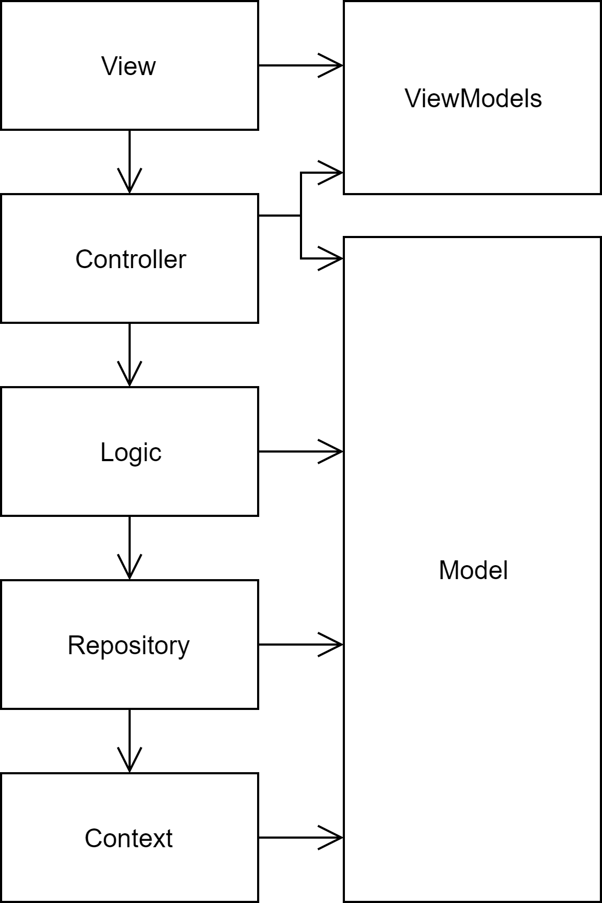
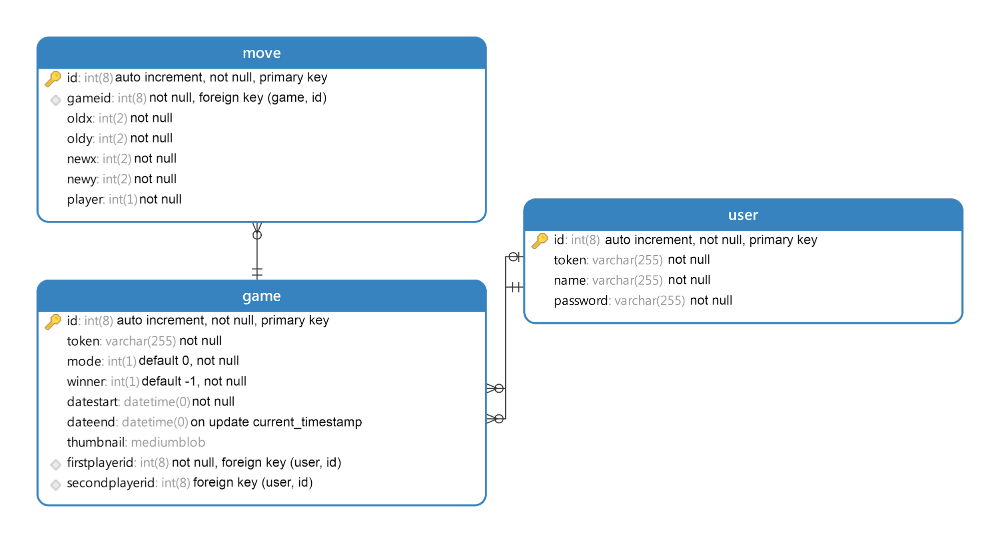
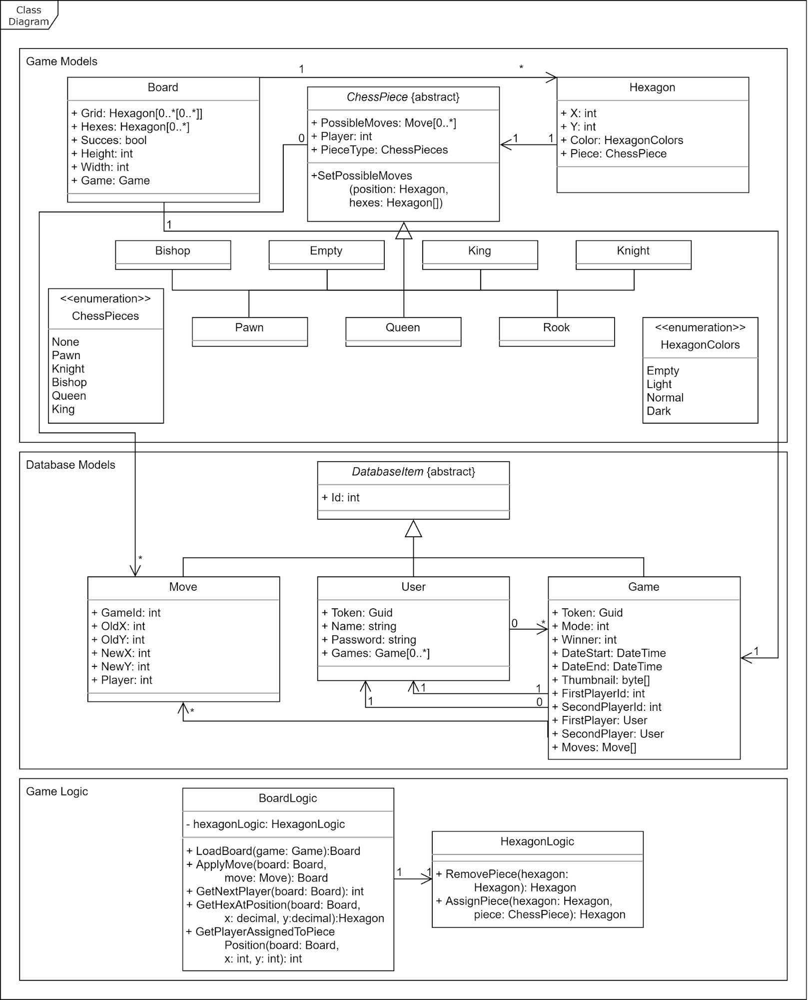
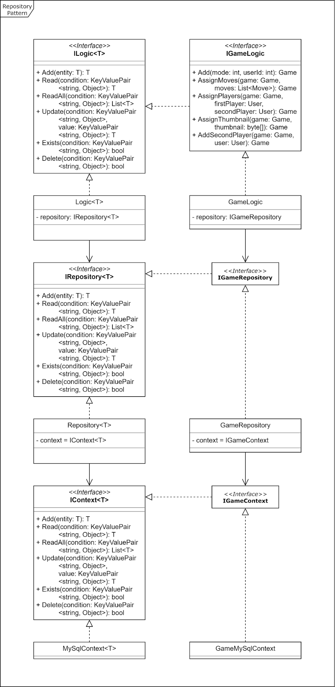

# Hexachess Ontwerpdocument

| Klas  | Semester 2 |
| :---- | ---------: |
| Datum | 14-06-2019 |

## Inhoud

[Inleiding](#inleiding)  
[Architectuur](#architectuur)  
[Databaseontwerp](#databaseontwerp)  
[Klassendiagram](#klassendiagram)  
[Game Models](#game-models)  
[Repository Pattern](#repository-pattern)

## Inleiding

Dit is het ontwerpdocument van Hexachess. Hierin worden de ontwerpen van de verschillende elementen binnen de applicatie weergegeven en gedocumenteerd.

## Architectuur

Hexachess is een ASP.NET Core MVC web app die gebouwd wordt volgens een lagenstructuur die ervoor zorgt dat alle verschillende aspecten van de applicatie makkelijk uitbreidbaar en vervangbaar zijn.

De logica kan worden opgevraagd door de controller via een factory die de juiste context toewijst, hierdoor kunnen verschillende manieren van data opslag worden gebruikt.

ViewModels is geen aparte laag maar hoort bij de View laag. De models worden vertaald naar viewmodels door de controller zodat er geen gevoelige informatie wordt verstuurd naar de View.

## Databaseontwerp

Wanneer een gebruiker is ingelogd worden de aangemaakte spellen in de database gekoppeld aan het userid van de gebruiker. In de game tabel wordt de winnaar, start- en einddatum, thumbnail en de gamemode opgeslagen.

Ook worden de games gekoppelt aan de zetten die plaats hebben gevonden in het spel. Dit gebeurt in de move tabel waar er een moveid wordt aangemaakt om de zetten in te laden op chronologische volgorde, ook wordt de move gelinkt aan een gameid en worden de oude en nieuwe positie van de zetten opgeslagen. Met deze informatie kan het programma het spel later reproduceren.

Wanneer een speler een game van het gamemode type multiplayer joint wordt de game geüpdatet en wordt het secondplayerid ingesteld op het userid van de tweede speler. Aan zowel de users als games worden tokens toegevoegd waarmee de users en games opgehaald kunnen worden.

## Klassendiagram

### Game Models

#### Board

De board klasse bevat een lijst genaamd hexes, waar alle hexagonen in worden toegevoegd bij het genereren van een bord. Ook bevat de klasse een grid. Deze grid is een tweedimensionale lijst waar voor iedere rij een lijst wordt gevuld met de hexagonen die erin horen. Deze lijst wordt door de front-end gebruikt zodat de hexagonen makkelijk op de juiste plek neergezet kunnen worden.

Verder bevat het object ook een Succes bool die naar true wordt gezet wanneer acties die zijn uitgevoerd in de game geldig zijn. Voor de rest wordt de height en width van het bord ook ingesteld, deze zijn namelijk variabel maar voor hexagonaal schaken zijn de hoogte en breedte altijd 11.

Tot slot wordt ook het game object waar het bord op is gebaseerd opgeslagen in de board klasse zodat de front end weet welke gamemode, spelers en moves (etc) de game bevat.

#### Hexagon

De Hexagon klasse bevat de X en Y coördinaten van de hexagon op de grid. Ook wordt de juiste kleur en het schaakstuk opgeslagen in het object.

#### ChessPiece

Alle schaakstukken erven de ChessPiece klasse over. Deze klasse bevat de mogelijke zetten die een schaakstuk kan ondergaan, de speler aan wie het schaakstuk is toegewezen en het type schaakstuk. Iedere overerving van deze klasse heeft zijn eigen implementatie van de SetPossibleMoves methode.

#### ChessPieces

Deze enumeration wordt gebruikt door de front-end, om de juiste afbeeldingen toe te wijzen aan de schaakstukken.

#### HexagonColors

Deze enumeration wordt gebruikt door de front-end, om de juiste kleuren toe te wijzen aan de hexagonen.

### Database Models

#### DatabaseItem

Deze abstracte klasse wordt door iedere klasse overgeërfd. De klasse bevat de variabele die ieder database item bevat, namelijk het ID. Dankzij deze klasse kan er makkelijk worden gerefereerd naar verschillende types database items.

#### User

Het user object bevat alle informatie die over de user opgeslagen wordt in de database. Daarnaast wordt er ook een lijst van games in opgeslagen. Nadat de user wordt opgehaald uit de database kunnen ook alle games die de user heeft gespeeld aan de user worden gekoppeld.

#### Game

Het game object bevat ook alle informatie die over de game wordt opgeslagen. Daarnaast worden ook de spelers opgehaald met behulp van de opgeslagen user id’s. Deze user objecten worden gekoppeld aan de first en secondplayer variabelen.

#### Move

Het move object bevat ook alle informatie die opgeslagen wordt in de database. Daarnaast wordt deze klasse ook gebruikt door het schaakstuk object om alle mogelijke zetten op te bewaren. Vanuit de front-end wordt er wanneer een zet geplaatst wordt ook een move object verstuurd.

### Game Logic

#### BoardLogic

Deze logica heeft niets te maken met de logica van het repository pattern. Deze logica kan een bordt genereren op basis van een game object die geladen wordt uit de database. In de LoadBoard methode worden eerst alle hexagonen aangemaakt met de juiste posities en kleuren.

Daarna worden alle schaakstukken op de juiste start plaatsen neergezet. Dan wordt er gekeken naar alle zetten die plaats hebben gevonden in het spel. Deze worden vervolgens toegepast.

Wanneer er een zet wordt geplaatst checkt deze klasse of de zet overeenkomt met een van de mogelijke posities van het schaakstuk, de speler die de zet plaatst wel aan de beurt is en of het stuk van die speler is. Als dat het geval is wordt het schaakstuk verplaatst, de succes bool van het bord object op true gezet, en wordt de nieuwe versie van het bord terug gestuurd naar de front-end door de controller.

#### HexagonLogic

De HexagonLogic heeft ook niets te maken met het repository pattern. Deze logica verzorgt het verplaatsen van de schaakstukken. Een schaakstuk wordt bij een verplaatsing verwijderd van de ene hexagon, en toegevoegd aan de andere.

## Repository Pattern

Het repository pattern in mijn applicatie koppelt de database los van de logica. Er wordt gebruik gemaakt van interfaces zodat de klassen die de data ophalen verwisseld kunnen worden. Daarnaast worden de database items als generic type meegegeven aan deze klassen zodat de basisfunctionaliteit van de repository voor ieder database model werkt.

Daarnaast hebben de database items ook nog een eigen interface die gebruikt wordt voor mogelijke specifieke acties. Voor ieder item wordt een instantie van hun respectieve logic interface aangemaakt. Op basis van de geselecteerde database wordt de juiste context classe toegewezen.

In het diagram is het repository pattern voor het game model uitgewerkt als voorbeeld, voor de andere models die worden opgeslagen in de database geldt een soortgelijke versie van dit diagram.